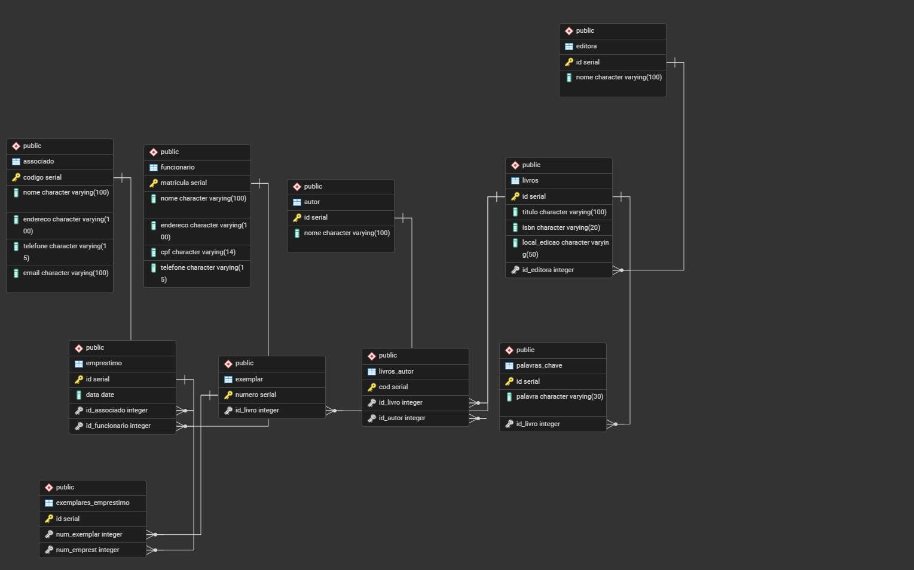

# Análise SQL - Banco Biblioteca

Este projeto apresenta a criação, estruturação e análise de um banco de dados fictício para uma biblioteca. O objetivo principal é praticar conceitos de SQL e banco de dados relacional, incluindo criação de tabelas, definição de relacionamentos, inserção de registros e desenvolvimento de consultas para análise das informações armazenadas.

O banco simula o funcionamento básico de uma biblioteca, contendo dados sobre editoras, autores, livros, palavras-chave, exemplares, associados, funcionários, empréstimos e exemplares emprestados.

## Objetivo do projeto

O objetivo deste projeto é demonstrar a aplicação prática de SQL em um cenário simples de análise de dados, utilizando um banco de dados relacional para responder perguntas relacionadas ao acervo e à movimentação de empréstimos da biblioteca.

Entre as análises realizadas estão:

* Consulta de livros por título, editora e local de edição;
* Relação entre livros, autores e editoras;
* Consulta de empréstimos por período;
* Identificação de associados com empréstimos registrados;
* Totalização de livros por editora;
* Totalização de empréstimos por associado;
* Análise de livros mais emprestados;
* Análise de funcionários com maior quantidade de atendimentos.

## Tecnologias utilizadas

* PostgreSQL
* pgAdmin
* SQL
* GitHub

## Estrutura do projeto

```text
biblioteca-sql-analise/
│
├── README.md
│
├── database/
│   ├── 01_criacao_tabelas.sql
│   ├── 02_inserts_base.sql
│   └── 03_inserts_emprestimos.sql
│
├── queries/
│   ├── 01_consultas_basicas.sql
│   ├── 02_consultas_com_joins.sql
│   ├── 03_consultas_com_group_by.sql
│   └── 04_consultas_analiticas.sql
│
└── docs/
    └── modelo_banco.png
```

## Descrição dos arquivos

### database/

A pasta `database` contém os scripts responsáveis pela criação e população do banco de dados.

| Arquivo                      | Descrição                                                                                                      |
| ---------------------------- | -------------------------------------------------------------------------------------------------------------- |
| `01_criacao_tabelas.sql`     | Criação das tabelas e definição dos relacionamentos entre elas.                                                |
| `02_inserts_base.sql`        | Inserção dos dados principais do banco, como editoras, autores, livros, exemplares, funcionários e associados. |
| `03_inserts_emprestimos.sql` | Inserção dos registros de empréstimos e dos exemplares vinculados a cada empréstimo.                           |

### queries/

A pasta `queries` contém as consultas SQL desenvolvidas para explorar e analisar os dados do banco.

| Arquivo                         | Descrição                                                                                  |
| ------------------------------- | ------------------------------------------------------------------------------------------ |
| `01_consultas_basicas.sql`      | Consultas simples utilizando filtros, ordenação e paginação.                               |
| `02_consultas_com_joins.sql`    | Consultas utilizando `JOIN` para relacionar informações entre tabelas.                     |
| `03_consultas_com_group_by.sql` | Consultas com `GROUP BY` para agrupamento e totalização de dados.                          |
| `04_consultas_analiticas.sql`   | Consultas voltadas à análise dos empréstimos, associados, funcionários, livros e editoras. |

### docs/

A pasta `docs` contém a imagem do modelo do banco de dados gerada no pgAdmin.

## Modelo do banco de dados

A estrutura relacional do banco foi representada por meio de um diagrama gerado no pgAdmin, permitindo visualizar as tabelas, chaves primárias, chaves estrangeiras e os relacionamentos existentes entre as entidades.



## Principais tabelas do banco

O banco de dados é composto pelas seguintes tabelas:

| Tabela                  | Descrição                                                 |
| ----------------------- | --------------------------------------------------------- |
| `editora`               | Armazena as editoras dos livros.                          |
| `autor`                 | Armazena os autores cadastrados.                          |
| `livros`                | Armazena os livros disponíveis no acervo.                 |
| `livros_autor`          | Relaciona livros e autores.                               |
| `palavras_chave`        | Armazena palavras-chave associadas aos livros.            |
| `exemplar`              | Armazena os exemplares físicos dos livros.                |
| `funcionario`           | Armazena os funcionários responsáveis pelos atendimentos. |
| `associado`             | Armazena os associados da biblioteca.                     |
| `emprestimo`            | Armazena os empréstimos realizados.                       |
| `exemplares_emprestimo` | Relaciona os exemplares aos empréstimos realizados.       |

## Como executar o projeto

Para executar o projeto, é necessário ter o PostgreSQL instalado e utilizar uma ferramenta de gerenciamento, como o pgAdmin.

A ordem recomendada de execução dos scripts é:

```sql
-- 1º Criar as tabelas e relacionamentos
database/01_criacao_tabelas.sql

-- 2º Inserir os dados principais
database/02_inserts_base.sql

-- 3º Inserir os empréstimos e exemplares emprestados
database/03_inserts_emprestimos.sql
```

Após a criação e população do banco, as consultas podem ser executadas a partir dos arquivos da pasta `queries`.

## Exemplos de análises realizadas

### Livros mais emprestados

Consulta utilizada para identificar os livros com maior quantidade de empréstimos registrados.

```sql
SELECT 
    l.titulo,
    COUNT(ee.id) AS quantidade_emprestimos
FROM exemplares_emprestimo ee
INNER JOIN exemplar ex ON ee.num_exemplar = ex.numero
INNER JOIN livros l ON ex.id_livro = l.id
GROUP BY l.titulo
ORDER BY quantidade_emprestimos DESC;
```

### Funcionários com maior quantidade de atendimentos

Consulta utilizada para verificar quais funcionários registraram mais atendimentos de empréstimos.

```sql
SELECT 
    f.nome,
    COUNT(e.id) AS quantidade_atendimentos
FROM funcionario f
INNER JOIN emprestimo e ON f.matricula = e.id_funcionario
GROUP BY f.nome
ORDER BY quantidade_atendimentos DESC;
```

### Associados com maior quantidade de empréstimos

Consulta utilizada para identificar os associados mais ativos da biblioteca.

```sql
SELECT 
    a.nome,
    COUNT(e.id) AS quantidade_emprestimos
FROM associado a
INNER JOIN emprestimo e ON a.codigo = e.id_associado
GROUP BY a.nome
ORDER BY quantidade_emprestimos DESC;
```

### Quantidade de livros por editora

Consulta utilizada para analisar a distribuição dos livros cadastrados por editora.

```sql
SELECT 
    ed.nome AS editora,
    COUNT(l.id) AS quantidade_livros
FROM editora ed
LEFT JOIN livros l ON ed.id = l.id_editora
GROUP BY ed.nome
ORDER BY quantidade_livros DESC;
```

## Observação sobre os dados

Todos os dados utilizados neste projeto são fictícios e foram criados apenas para fins educacionais. Os nomes, endereços, telefones, e-mails e documentos presentes na base não representam pessoas reais.

## Aprendizados praticados

Durante o desenvolvimento deste projeto, foram praticados conceitos como:

* Criação de tabelas com `CREATE TABLE`;
* Definição de chaves primárias e estrangeiras;
* Inserção de dados com `INSERT INTO`;
* Consultas com `SELECT`;
* Filtros com `WHERE`;
* Ordenação com `ORDER BY`;
* Relacionamento entre tabelas com `INNER JOIN` e `LEFT JOIN`;
* Agrupamento de dados com `GROUP BY`;
* Filtros em agrupamentos com `HAVING`;
* Limitação e paginação de resultados com `LIMIT` e `OFFSET`;
* Análise de dados utilizando SQL.

## Status do projeto

Projeto finalizado como estudo prático de SQL e banco de dados relacional, com foco em organização de scripts, consultas e apresentação em portfólio.
